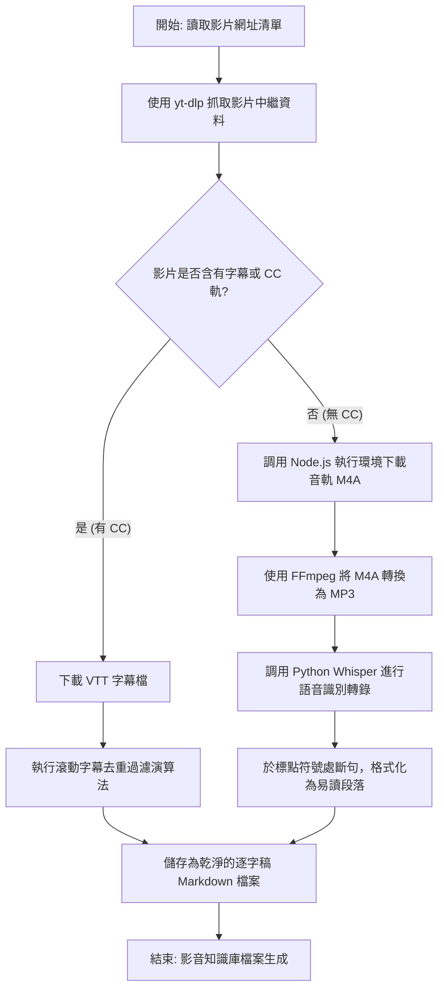

# YouTube 影音知識庫建構 Agent 工作流 (YouTube Knowledge Base Builder Agent Workflow)

本倉庫提供詳細的步驟與自動化腳本，供 AI Agent 從 YouTube 頻道的影片中建構乾淨的 Markdown 格式知識庫。

其他 AI Agent 讀取本倉庫後，可依照下列指引與腳本執行，自動建構出完整的影片逐字稿知識庫（同時支援**「有 CC 字幕」**與**「無 CC 字幕」**之影片）。

---

## 🛠️ 環境需求與準備工作

在開始執行工作流之前，請確保系統已安裝並設定好以下工具：

1. **Python 3.10+**：用於執行自動化腳本與文字解析。
2. **Node.js**：YouTube 簽章解密挑戰（n challenge）需要 JavaScript 執行環境，`yt-dlp` 會自動在背景調用 Node.js 來完成解密。
3. **yt-dlp**：強大的影音下載工具。請將 `yt-dlp.exe`（Windows）放置於本專案根目錄，或將其設定於系統 `PATH` 環境變數中。
4. **FFmpeg**：用於音訊轉檔與合併。安裝指令：
   * Windows: `winget install Gyan.FFmpeg --source winget`
   * macOS: `brew install ffmpeg`
   * Linux: `sudo apt install ffmpeg`
5. **Whisper (Python 套件)**：用於對「沒有 CC 字幕」的影片進行本地語音識別（ASR）與轉錄。
   * 安裝指令：`pip install openai-whisper torch`

---

## 📋 完整工作流程

### 步驟 1：掃描與篩選影片
我們會先掃描目標 YouTube 頻道（例如 `@sensebar`）的所有影片標題與網址，並根據關鍵字（如 `claude`、`codex`、`antigravity`、`opencode`、`agent`）進行篩選。

請將以下程式碼儲存為 `fetch_urls.py` 並執行：`python fetch_urls.py`

```python
import subprocess
import json
import os

url = "https://www.youtube.com/@sensebar/videos"
yt_dlp_path = "./yt-dlp.exe"  # 若已設定系統變數，可改為 "yt-dlp"

# 強制將 yt-dlp 的 stdout 設為 UTF-8 編碼，防止 Windows 系統下解析亂碼
env = os.environ.copy()
env["PYTHONIOENCODING"] = "utf-8"

cmd = [
    yt_dlp_path,
    "--flat-playlist",
    "--print",
    '{"title": %(title)q, "url": %(url)q}',
    url
]

print("正在獲取影片清單...")
result = subprocess.run(cmd, capture_output=True, env=env)
if result.returncode != 0:
    print("錯誤：", result.stderr.decode('utf-8', errors='replace'))
    exit(1)

lines = result.stdout.decode('utf-8', errors='replace').strip().split("\n")
videos = []
for line in lines:
    if line.strip():
        try:
            videos.append(json.loads(line))
        except:
            continue

# 篩選關鍵字 (不區分大小寫)
keywords = ["claude", "codex", "antigravity", "opencode", "agent"]
matched = []
for v in videos:
    title_lower = v['title'].lower()
    if any((kw in title_lower or (kw == "opencode" and "open code" in title_lower)) for kw in keywords):
        matched.append(v)

# 儲存篩選後的網址
with open("urls_list.txt", "w", encoding="utf-8") as f:
    for mv in matched:
        f.write(f"{mv['url']}\n")
        
print(f"成功將 {len(matched)} 個相符的影片網址儲存至 urls_list.txt")
```

---

### 步驟 2：獲取逐字稿（區分 CC 與 無 CC 影片）

針對 `urls_list.txt` 中的每一個影片網址，執行分支判斷：
- **若影片含有 CC 字幕（或自動生成字幕）**：下載 `.vtt` 字幕檔，並透過算法清理時間戳記與重複累積的滾動字幕。
- **若影片沒有任何字幕**：下載該影片的 M4A 高音質音軌，使用 FFmpeg 轉換為 MP3，並啟動本地端的 Whisper 模型進行自動語音識別與轉錄。

請將以下程式碼儲存為 `build_knowledge_base.py` 並執行：`python build_knowledge_base.py`

```python
import os
import subprocess
import json
import re
import glob

workspace_dir = "."
yt_dlp_path = "./yt-dlp.exe"  # 或 "yt-dlp"
urls_file = "urls_list.txt"

# 載入 Whisper 語音識別模型 (用於無字幕影片)
try:
    import whisper
    whisper_model = whisper.load_model("base")  # 可依硬體改用 'base'、'small' 或 'medium'
except ImportError:
    print("未偵測到 Whisper 套件。無 CC 字幕的影片將被跳過。請執行 'pip install openai-whisper' 安裝。")
    whisper_model = None

def clean_filename(filename):
    # 移除檔名中的不合法字元
    filename = re.sub(r'[\\/*?:"<>|]', "_", filename)
    filename = re.sub(r'_+', '_', filename)
    return filename.strip()

def parse_vtt(vtt_path):
    if not os.path.exists(vtt_path):
        return ""
    with open(vtt_path, "r", encoding="utf-8") as f:
        content = f.read()
    lines = content.split("\n")
    clean_lines = []
    for line in lines:
        line = line.strip()
        # 跳過 VTT 標頭與時間戳記
        if not line or line.startswith("WEBVTT") or line.startswith("Kind:") or line.startswith("Language:") or "-->" in line:
            continue
        # 移除 HTML 標籤
        line = re.sub(r'<[^>]+>', '', line).strip()
        if not line:
            continue
        
        # 針對 YouTube 滾動字幕的去重過濾演算法
        if not clean_lines:
            clean_lines.append(line)
        else:
            last = clean_lines[-1]
            if line.startswith(last):
                clean_lines[-1] = line
            elif last.startswith(line):
                continue
            else:
                clean_lines.append(line)
    return "\n\n".join(clean_lines)

# 讀取待處理網址
if not os.path.exists(urls_file):
    print("找不到 urls_list.txt，請先執行 fetch_urls.py。")
    exit(1)
    
with open(urls_file, "r", encoding="utf-8") as f:
    urls = [line.strip() for line in f if line.strip()]

env = os.environ.copy()
env["PYTHONIOENCODING"] = "utf-8"

for idx, url in enumerate(urls, 1):
    print(f"\n[{idx}/{len(urls)}] 正在處理：{url}...")
    
    # 1. 取得影片中繼資料
    info_cmd = [yt_dlp_path, "--skip-download", "--dump-json", url]
    res = subprocess.run(info_cmd, capture_output=True, env=env)
    if res.returncode != 0:
        continue
    try:
        info_json = json.loads(res.stdout.decode('utf-8'))
        title = info_json.get("title")
        video_id = info_json.get("id")
        subtitles = info_json.get("subtitles", {})
        auto_subtitles = info_json.get("automatic_captions", {})
    except Exception as e:
        print(f"解析 JSON 失敗：{e}")
        continue

    print(f"影片標題：{title}")
    safe_title = clean_filename(title)
    md_path = f"{safe_title}.md"
    
    # 判斷是否有字幕軌
    has_cc = len(subtitles) > 0 or len(auto_subtitles) > 0
    
    # ------------------ 分支 A：有 CC 字幕 ------------------
    if has_cc:
        print("-> 偵測到影片內建/自動生成字幕 (CC)。開始下載字幕檔...")
        temp_prefix = f"temp_sub_{video_id}"
        dl_cmd = [
            yt_dlp_path,
            "--skip-download",
            "--write-subs",
            "--write-auto-subs",
            "--sub-lang", "zh-Hant,zh-TW,zh,en",
            "--sub-format", "vtt",
            "-o", f"{temp_prefix}.%(ext)s",
            url
        ]
        subprocess.run(dl_cmd, capture_output=True)
        sub_files = glob.glob(f"{temp_prefix}.*")
        
        if sub_files:
            vtt_file = sub_files[0]
            clean_text = parse_vtt(vtt_file)
            
            # 寫入 Markdown 知識庫
            with open(md_path, "w", encoding="utf-8") as f:
                f.write(f"# {title}\n\n- **YouTube 影片網址**: {url}\n- **字幕來源**: YouTube 內建 CC 字幕\n\n## 影片逐字稿\n\n{clean_text}\n")
            print(f"成功存檔：{md_path}")
            
            # 刪除暫存的 VTT
            for sf in sub_files:
                os.remove(sf)
        else:
            print("無法成功下載 VTT 字幕，將改採音訊下載與語音識別...")
            has_cc = False
            
    # ------------------ 分支 B：無 CC 字幕 ------------------
    if not has_cc:
        if not whisper_model:
            print("-> 此影片無 CC 字幕，且本地未載入 Whisper 模型，跳過處理。")
            continue
            
        print("-> 此影片沒有 CC 字幕。正在下載音訊檔以進行 AI 轉錄...")
        temp_audio = f"temp_audio_{video_id}.m4a"
        temp_mp3 = f"temp_audio_{video_id}.mp3"
        
        # 下載 M4A 音軌 (指定 node 破解下載限制)
        dl_cmd = [
            yt_dlp_path,
            "--js-runtimes", "node",
            "-f", "140",
            "-o", temp_audio,
            url
        ]
        dl_res = subprocess.run(dl_cmd, capture_output=True)
        
        if dl_res.returncode == 0 and os.path.exists(temp_audio):
            # 轉檔為 MP3 方便 Whisper 處理
            ffmpeg_cmd = ["ffmpeg", "-y", "-i", temp_audio, "-acodec", "libmp3lame", "-aq", "2", temp_mp3]
            subprocess.run(ffmpeg_cmd, capture_output=True)
            os.remove(temp_audio)
            
            if os.path.exists(temp_mp3):
                print(f"正在使用 Whisper 模型分析並語音識別 {temp_mp3}...")
                result = whisper_model.transcribe(temp_mp3, language="zh")
                transcribed_text = result.get("text", "")
                
                # 將大段文字在句號/問號/驚嘆號處自動換行，提高可讀性
                formatted_text = "\n\n".join(re.split(r'(?<=[。！？])\s*', transcribed_text))
                
                with open(md_path, "w", encoding="utf-8") as f:
                    f.write(f"# {title}\n\n- **YouTube 影片網址**: {url}\n- **字幕來源**: Whisper 本地 AI 語音轉錄\n\n## 影片逐字稿\n\n{formatted_text}\n")
                print(f"轉錄成功並已存檔：{md_path}")
                os.remove(temp_mp3)
            else:
                print("音訊轉檔為 MP3 失敗。")
        else:
            print("音軌下載失敗。")
            
print("所有影片知識庫建構完成！")
```

---

## 🎯 決策架構圖 (Decision Architecture Diagram)

以下是 AI Agent 在處理影片與建構知識庫時的內部決策與執行邏輯：


