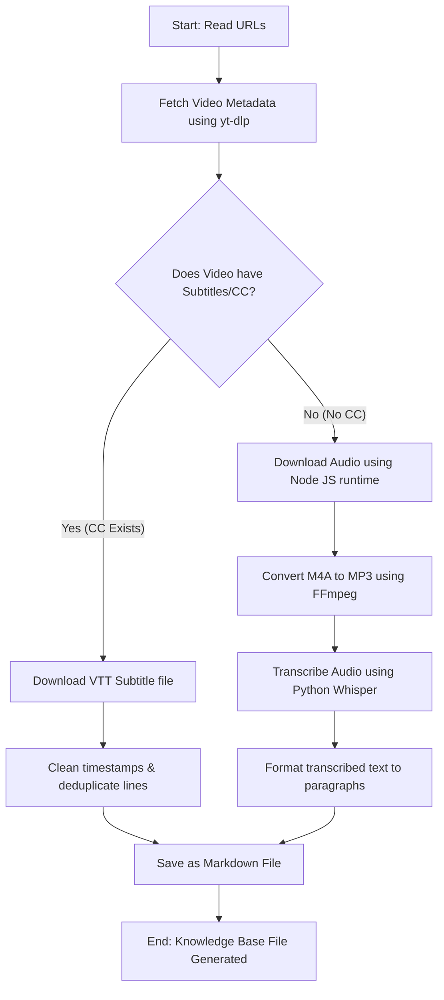

# YouTube Knowledge Base Builder Agent Workflow

This repository provides a step-by-step workflow and automated scripts for an AI Agent to build a clean Markdown-based knowledge base from a YouTube channel's videos.

Other AI Agents reading this repository can follow the guidelines and execute the scripts below to construct a structured knowledge base of video transcripts (both with and without Closed Captions).

---

## 🛠️ Prerequisites

Before starting the workflow, ensure the following tools are installed and configured on the system:

1. **Python 3.10+**: For running orchestration and parsing scripts.
2. **Node.js**: YouTube signature decryption (the "n challenge") requires a JavaScript runtime. `yt-dlp` will automatically use Node.js if it is specified in the parameters.
3. **yt-dlp**: A command-line media downloader. Place `yt-dlp.exe` (Windows) or the executable in the project root or system PATH.
4. **FFmpeg**: Required for audio conversion and extracting media. Install via:
   - Windows: `winget install Gyan.FFmpeg --source winget`
   - macOS: `brew install ffmpeg`
   - Linux: `sudo apt install ffmpeg`
5. **Whisper (Python)**: For transcribing videos that do not have Close Captions (CC).
   - Install via pip: `pip install openai-whisper torch`

---

## 📋 Complete Workflow

### Step 1: Scan and Filter Videos
We scan the targeted YouTube channel (e.g., `@sensebar`) to list all video titles and URLs, then filter them based on interest keywords (e.g., `claude`, `codex`, `antigravity`, `opencode`, `agent`).

Run the following Python script to get a filtered URL list:
- Save this as `fetch_urls.py` and run: `python fetch_urls.py`

```python
import subprocess
import json
import os

url = "https://www.youtube.com/@sensebar/videos"
yt_dlp_path = "./yt-dlp.exe"  # or "yt-dlp" if in PATH

# Force UTF-8 encoding for yt-dlp stdout
env = os.environ.copy()
env["PYTHONIOENCODING"] = "utf-8"

cmd = [
    yt_dlp_path,
    "--flat-playlist",
    "--print",
    '{"title": %(title)q, "url": %(url)q}',
    url
]

print("Fetching videos...")
result = subprocess.run(cmd, capture_output=True, env=env)
if result.returncode != 0:
    print("Error:", result.stderr.decode('utf-8', errors='replace'))
    exit(1)

lines = result.stdout.decode('utf-8', errors='replace').strip().split("\n")
videos = []
for line in lines:
    if line.strip():
        try:
            videos.append(json.loads(line))
        except:
            continue

# Filter keywords (case-insensitive)
keywords = ["claude", "codex", "antigravity", "opencode", "agent"]
matched = []
for v in videos:
    title_lower = v['title'].lower()
    if any((kw in title_lower or (kw == "opencode" and "open code" in title_lower)) for kw in keywords):
        matched.append(v)

# Save URLs
with open("urls_list.txt", "w", encoding="utf-8") as f:
    for mv in matched:
        f.write(f"{mv['url']}\n")
        
print(f"Saved {len(matched)} matching URLs to urls_list.txt")
```

---

### Step 2: Fetch Transcripts (The CC and Non-CC Branch)

For each video URL, we must first detect if Closed Captions (CC) or auto-generated subtitles are available. 
- If CC **exists**, we download the `.vtt` file and clean it up.
- If CC **does not exist**, we download the high-quality audio track (M4A), convert it to MP3, and use Whisper to transcribe it.

Here is the complete Python script `build_knowledge_base.py` that handles both branches:

```python
import os
import subprocess
import json
import re
import glob

workspace_dir = "."
yt_dlp_path = "./yt-dlp.exe"  # or "yt-dlp"
urls_file = "urls_list.txt"

# Ensure Whisper is imported for non-CC transcription
try:
    import whisper
    whisper_model = whisper.load_model("base")  # Use 'base' or 'small' for speed/accuracy balance
except ImportError:
    print("Whisper is not installed. Videos without CC will be skipped. Run 'pip install openai-whisper' to enable.")
    whisper_model = None

def clean_filename(filename):
    filename = re.sub(r'[\\/*?:"<>|]', "_", filename)
    filename = re.sub(r'_+', '_', filename)
    return filename.strip()

def parse_vtt(vtt_path):
    if not os.path.exists(vtt_path):
        return ""
    with open(vtt_path, "r", encoding="utf-8") as f:
        content = f.read()
    lines = content.split("\n")
    clean_lines = []
    for line in lines:
        line = line.strip()
        if not line or line.startswith("WEBVTT") or line.startswith("Kind:") or line.startswith("Language:") or "-->" in line:
            continue
        line = re.sub(r'<[^>]+>', '', line).strip()
        if not line:
            continue
        if not clean_lines:
            clean_lines.append(line)
        else:
            last = clean_lines[-1]
            if line.startswith(last):
                clean_lines[-1] = line
            elif last.startswith(line):
                continue
            else:
                clean_lines.append(line)
    return "\n\n".join(clean_lines)

# Read URLs
if not os.path.exists(urls_file):
    print("urls_list.txt not found. Run fetch_urls.py first.")
    exit(1)
    
with open(urls_file, "r", encoding="utf-8") as f:
    urls = [line.strip() for line in f if line.strip()]

env = os.environ.copy()
env["PYTHONIOENCODING"] = "utf-8"

for idx, url in enumerate(urls, 1):
    print(f"\n[{idx}/{len(urls)}] Processing {url}...")
    
    # 1. Fetch JSON Info
    info_cmd = [yt_dlp_path, "--skip-download", "--dump-json", url]
    res = subprocess.run(info_cmd, capture_output=True, env=env)
    if res.returncode != 0:
        continue
    try:
        info_json = json.loads(res.stdout.decode('utf-8'))
        title = info_json.get("title")
        video_id = info_json.get("id")
        subtitles = info_json.get("subtitles", {})
        auto_subtitles = info_json.get("automatic_captions", {})
    except Exception as e:
        print(f"Error parsing metadata: {e}")
        continue

    print(f"Title: {title}")
    safe_title = clean_filename(title)
    md_path = f"{safe_title}.md"
    
    # Check if CC (Closed Caption) or Auto-subtitles are available
    has_cc = len(subtitles) > 0 or len(auto_subtitles) > 0
    
    if has_cc:
        print("-> Found Closed Captions (CC). Downloading subtitles...")
        temp_prefix = f"temp_sub_{video_id}"
        dl_cmd = [
            yt_dlp_path,
            "--skip-download",
            "--write-subs",
            "--write-auto-subs",
            "--sub-lang", "zh-Hant,zh-TW,zh,en",
            "--sub-format", "vtt",
            "-o", f"{temp_prefix}.%(ext)s",
            url
        ]
        subprocess.run(dl_cmd, capture_output=True)
        sub_files = glob.glob(f"{temp_prefix}.*")
        
        if sub_files:
            vtt_file = sub_files[0]
            clean_text = parse_vtt(vtt_file)
            
            # Save Transcript Markdown
            with open(md_path, "w", encoding="utf-8") as f:
                f.write(f"# {title}\n\n- **YouTube Link**: {url}\n- **Source**: YouTube Closed Captions (CC)\n\n## Transcript\n\n{clean_text}\n")
            print(f"Saved: {md_path}")
            
            # Clean temp VTT
            for sf in sub_files:
                os.remove(sf)
        else:
            print("Failed to download VTT subtitle file. Falling back to audio download...")
            has_cc = False
            
    if not has_cc:
        if not whisper_model:
            print("-> No CC available and Whisper is not loaded. Skipping transcription.")
            continue
            
        print("-> No CC found. Downloading audio for Whisper transcription...")
        temp_audio = f"temp_audio_{video_id}.m4a"
        temp_mp3 = f"temp_audio_{video_id}.mp3"
        
        # Download audio using Node.js to solve challenges
        dl_cmd = [
            yt_dlp_path,
            "--js-runtimes", "node",
            "-f", "140",
            "-o", temp_audio,
            url
        ]
        dl_res = subprocess.run(dl_cmd, capture_output=True)
        
        if dl_res.returncode == 0 and os.path.exists(temp_audio):
            # Convert to MP3
            ffmpeg_cmd = ["ffmpeg", "-y", "-i", temp_audio, "-acodec", "libmp3lame", "-aq", "2", temp_mp3]
            subprocess.run(ffmpeg_cmd, capture_output=True)
            os.remove(temp_audio)
            
            if os.path.exists(temp_mp3):
                print(f"Transcribing {temp_mp3} with Whisper...")
                result = whisper_model.transcribe(temp_mp3, language="zh")
                transcribed_text = result.get("text", "")
                
                # Format text slightly into paragraphs
                formatted_text = "\n\n".join(re.split(r'(?<=[。！？])\s*', transcribed_text))
                
                with open(md_path, "w", encoding="utf-8") as f:
                    f.write(f"# {title}\n\n- **YouTube Link**: {url}\n- **Source**: Whisper Local Transcription\n\n## Transcript\n\n{formatted_text}\n")
                print(f"Transcribed & Saved: {md_path}")
                os.remove(temp_mp3)
            else:
                print("Failed to convert audio to MP3.")
        else:
            print("Failed to download audio.")
            
print("Workflow completed!")
```

---

## 🎯 Architecture Diagram

Below is the decision path of the AI Agent during the knowledge building process:


